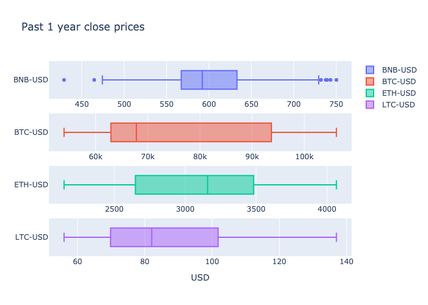

# COM724 AE2: SOL-igence - Development and Evaluation Report

## Introduction

The cryptocurrency market has experienced significant growth and volatility since its inception, creating both opportunities and challenges for investors, traders, and researchers (Corbet et al., 2019). The cryptocurrency market has 15.1 million different crypto assets; a 3.16 trillion USD market capitalisation, with Bitcoin holding 63.8 % of the current market capitalisation (CoinMarketCap 2025). Making informed investment decisions requires sophisticated analytical tools capable of processing vast amounts of data and identifying meaningful patterns (Sezer et al., 2020). Traditional financial analysis methods often fall short when applied to cryptocurrencies due to their unique characteristics, including extreme volatility, 24/7 trading, and sensitivity to technological, regulatory, and market sentiment factors (Fang et al., 2022).

This report documents the development of a cryptocurrency forecasting dashboard designed to address these challenges. The dashboard leverages machine learning techniques, real-time data integration, and interactive visualizations to provide actionable insights for cryptocurrency market participants. Expanding on conventional financial dashboards, this solution incorporates advanced time-series forecasting capabilities specifically optimised for cryptocurrency price prediction, correlation analysis, and investment decision support.

## Literature Review

The cryptocurrency forecasting domain has evolved from traditional statistical methods to advanced machine learning approaches. Corbet et al. (2019) established cryptocurrencies as a distinct asset class with unique volatility characteristics. Bariviera et al. (2017) identified non-linear dynamics in Bitcoin time series that challenge conventional modeling approaches.

Traditional time series methods such as ARIMA (Box et al., 2015) have shown limitations with cryptocurrency data, primarily due to non-stationarity issues. McNally et al. (2018) demonstrated that ensemble and boosting techniques outperform traditional statistical models for Bitcoin price prediction. This finding was reinforced by Chen and Guestrin's (2016) introduction of XGBoost, which has proven particularly effective for handling non-linear financial data.

Feature engineering approaches by Kristjanpoller and Minutolo (2018) highlighted the importance of combining technical indicators with traditional time series features, while Pintelas et al. (2020) emphasized how proper feature selection improves cryptocurrency forecasting accuracy. For multi-step forecasting, Lim and Zohren (2021) established best practices for direct prediction approaches over recursive methods, with Python implementations from Ludvigsen (2022).

Recent work by Sezer et al. (2020) has documented deep learning applications to financial time series, suggesting potential future directions. Hachicha et al (2023) introduced clustering techniques to identify distinct cryptocurrency market segments, enabling more targeted modeling strategies across different asset classes.

## Objectives and Problem Definition

### Problem Definition

The cryptocurrency market presents several unique challenges that this project aims to address:

1. The cryptocurrency ecosystem generates vast amounts of data across multiple platforms, making it difficult for individuals to process and interpret market dynamics effectively.

2. Both novice and experienced market participants require comprehensive tools that combine historical analysis, real-time monitoring, and predictive capabilities in an accessible interface.

3. Cryptocurrency price movements exhibit high volatility and non-linear patterns that are difficult to interpret.

4. Researchers and cryptocurrency newcomers require different levels of analytical depth, visualization options, and interpretability.

### Project Objectives

To address these challenges, the project established the following key objectives:

1. Connectivity with cryptocurrency exchange APIs to access current market data, while maintaining the ability to fall back on static datasets for testing and development purposes.

2. Develop interactive visualisations that adapt to user preferences, including time interval selection, profit targets, and specific cryptocurrencies of interest.

3. Create predictive models capable of generating price forecasts across useful timeframes with accuracy as a priority.

4. Provide recommendations on optimal entry points and target prices based on user-defined profit goals.

5. Identify and visualise relationships between different cryptocurrencies to support portfolio diversification strategies.

6. Utilise Python for both backend processing and machine learning components, with Streamlit for frontend development to ensure rapid iteration and deployment capabilities.

## Analysis, Evaluation and Results

### Data Collection and Preprocessing

The data pipeline begins with collection from the Binance API, chosen for its reliability, comprehensive coverage of major cryptocurrencies, and granular historical data access.

The preprocessing workflow consists of several key stages:

1. **Data Cleaning**: Handling missing values, reducing multi-level indexes, scaling and ensuring consistent datetime formatting across all datasets.

2. **Feature Engineering**: Creating technical indicators and derived features that capture market dynamics:
   - Lagged features (1, 3, 5-day) to capture short-term momentum
   - Moving averages (7 and 30-day) to identify trends
   - Volatility measures using rolling standard deviations
   - Relative Strength Index (RSI) to identify overbought/oversold conditions
   - Percentage price changes over various timeframes

   Leveraging engineered features, particularly technical indicators and lag variables, for machine learning models aligns with findings from Pintelas et al. (2020) on the importance of feature engineering.

3. **Sequence Creation**: Generating input-output pairs for model training, with 60-day input windows mapped to 30-day forecast horizons, creating a sliding window approach for multi-step forecasting.

### Clustering and Correlation

K-means clustering was used to determine relationships between cryptocurrencies. K-means clustering was chosen for its efficiency in identifying logical groupings of data (Hachicha et al. 2023).

Using a dataset containing last year's close prices of the top 30 market cap coins, the dataset was transformed from long to wide format i.e each day's close price as columns and a single row for each coin. Providing each coin as an observation for clustering with a rich set of features. To aid clustering performance, the dimensionality of the data was reduced to its optimal principal components (2).

  


  

Silhouette scoring was used to determine the optimal number of clusters. While fewer clusters achieved a higher score, higher-granularity could be achieved with four clusters while maintaining a strong separation performance (> 0.9).

  

The clusters provided a starting point for capturing different market states. Bitcoin variants were clustered together; this asset has demonstrated a significant increase in value, particularly over the past year. Etherium variants are clustered, representing a coin with significant price fluctuations, generally decreasing over the past year. BNB and Bitcoin Cash are clustered, both have been holding a stable value over the past year. The final cluster represent coins of lower value which haven't significantly increased in value.

From these four clusters, a representative coin was selected from each cluster for model evaluation.

Correlation analysis identifies coins that follow or oppose the market behaviour for the representative coins. This shall be leveraged to provide portfolio diversification insights.

|         |   BTC-USD |   WBTC-USD |   DOGE-USD |   HBAR-USD |    PI-USD |   TON-USD |   USDT-USD |    USDC-USD |
|:--------|----------:|-----------:|-----------:|-----------:|----------:|----------:|-----------:|------------:|
| BNB-USD |   0.82948 |   0.829018 |   0.806936 |   0.786174 | -0.193981 | -0.159604 | -0.0985299 | -0.00642017 |

|         |   WBTC-USD |   LEO-USD |   DOGE-USD |   XLM-USD |   TON-USD |    PI-USD |   USDC-USD |   USDT-USD |
|:--------|-----------:|----------:|-----------:|----------:|----------:|----------:|-----------:|-----------:|
| BTC-USD |   0.999971 |  0.954715 |   0.931514 |  0.930809 | -0.297925 | -0.201206 | -0.0540657 |  0.0495566 |

|         |   STETH-USD |   WETH-USD |   WSTETH-USD |   DOT-USD |    OM-USD |   TRX-USD |   USDC-USD |   USDT-USD |
|:--------|------------:|-----------:|-------------:|----------:|----------:|----------:|-----------:|-----------:|
| ETH-USD |    0.999967 |   0.999826 |     0.997976 |  0.848954 | -0.120443 | 0.0450684 |  0.0738517 |  0.0772101 |

|         |   HBAR-USD |   ADA-USD |   XRP-USD |   WBTC-USD |   TON-USD |   USDC-USD |   USDT-USD |   PI-USD |
|:--------|-----------:|----------:|----------:|-----------:|----------:|-----------:|-----------:|---------:|
| LTC-USD |   0.894071 |  0.884937 |    0.8645 |    0.86442 | -0.106227 | 0.00487731 |  0.0608996 | 0.132695 |  
Table: Top Positively and Negatively Correlated Coins - Pearson Correlation

### Exploratory Data Analysis and Time-Series Decomposition

1. Stationarity: Applying time series decomposition and Augmented Dickey-Fuller tests to assess stationarity properties of different cryptocurrencies. For example, Bitcoin (BTC) demonstrated non-stationarity with a high p-value, while Binance Coin (BNB) showed more stationary characteristics.

|         |      ADF |    P_Value |       1% |       5% |      10% | Stationary   |
|:--------|---------:|-----------:|---------:|---------:|---------:|:-------------|
| BNB-USD | -3.67848 | 0.00442625 | -3.44844 | -2.86951 | -2.57102 | True         |
| BTC-USD | -1.1333  | 0.701611   | -3.44844 | -2.86951 | -2.57102 | False        |
| ETH-USD | -2.05408 | 0.263377   | -3.44844 | -2.86951 | -2.57102 | False        |
| LTC-USD | -1.96639 | 0.301503   | -3.44844 | -2.86951 | -2.57102 | False        |  
Table: Statoinarity Analysis - ADF Test

2. Distribution: revealed asymmetric patterns with heavy left or right tails for most cryptocurrencies, with Bitcoin showing particularly high kurtosis.

  

  

3. Distrubtion over annual intervals: a general shift from postiviely skewed data to negatviely skewed from 2021 to 2025 with an increase in kurtosis. Indicating, increasing close price values and with a higher liklihood of extreme values. Litecoin being the exception which maintained a consistent concentration of close prices in a lower range.

  

  

These non-normal distributions and lack of consistent patterns between coins that could be derived from decomposition (i.e trend and seasonality), informed the selection of modeling approaches that could handle such data characteristics.

4. Autocorrelation: short-term partial autocorrelation indicated a useful indicator for feature engineering.

  

I.e. two to three time lags of statistical significance.

### Data Transformation

Data transformation techniques were evaluated to determine whether the data could be normalised to aid statistical modeling. Transformation may help to stabilise the wide variance in the data, reducing the effect of extreme values while preserving the magnitude of the differences between observations.

  

  

  

Neither log, square-root or box-cox transformation were able to approximate normality or trend. This encouraged the evaluation of bootsing models that train iteratively on residuals. Additionally due to the long term autocorrelation with no seasonailty, it may also be worth experimenting with models that give weight to short term observations.

### Feature Importance

Utilising random forest regression to determine the relative importance of engineered features derived from the close prices.


Accross the representative cryptocurrencies, the following derived features returned the highest relative importance:

- lags 1, 3 and 5.
- 7-day and 30-day moving averages.

### Model Selection and Optimization

The model selection process employed a structured evaluation of multiple forecasting approaches:

1. **Statistical Models**:
   - ARIMA: Traditional time series forecasting with autoregressive and moving average components.
   - Exponential Smoothing: Assumes no trend or seasonality and the ability to bias short-term dependencies through exponential weighting.

2. **Machine Learning Models**:
   - Random Forest.
   - XGBoost with optimised hyperparameters.
   - Prophet (Facebook's forecasting tool).

The evaluation metrics included Mean Absolute Error (MAE), Root Mean Squared Error (RMSE), Mean Absolute Percentage Error (MAPE) and R-squared score; to assess model performance.

#### Model Assessment

#### Arima

ARIMA models have been widely used in financial forecasting (Box et al., 2015) to capture linear temporal relationships. This presents some limitations:

1. Most of the representative coins exhibit no stationarity, despite attempts to transform or difference the data.
2. Time series decomposition revealed non-linear patters over lagged periods also noted by Bariviera et al. (2017).
3. Capturing high volatility i.e high variance resulted in low R-squared scores.

| Model   |   MASE |   RMSSE |     MAE |    RMSE |   MAPE |   SMAPE |      R2 |
|:--------|-------:|--------:|--------:|--------:|-------:|--------:|--------:|
| ARIMA   | 1.2824 |  1.0809 | 3192.87 | 3989.93 | 0.0391 |  0.0379 | -1.4911 |  
Table: Arima Performance Evaluation - BTC Past 5 Year Close Prices

  

The poorer performance aligns with the observations from McNally et al. (2017). Due to its popularity, it was selected for evaluation as a means to compare against other methods.

#### Exponential Smoothing

Single exponential smoothing was selected for it's ability to perform regression on univariate data with decreasing weights for older observations (Brownlee 2020). Despite this model's ability to adapt to changing trends, it exhibited similar limitations:

1. The long term autocorrelation in the close prices may have caused poor performance (Kristjanpoller and Minutolo, 2018).
2. Lacking complexity required to model short term volatility.
3. Acheiving slightly bettere results that ARIMA but underperforming.

| Model   |   MASE |   RMSSE |     MAE |    RMSE |   MAPE |   SMAPE |      R2 |
|:--------|-------:|--------:|--------:|--------:|-------:|--------:|--------:|
| Exponential Smoothing | 0.7698 |0.6517	| 5246.4672 | 6196.5309	| 0.0582	| 0.0556 |-1.3908 |  
Table: Exponential Smoothing Evaluation

4. Differencing the data showed noticable improvement.

| Model                  | MASE   | RMSSE  | MAE       | RMSE      | MAPE   | SMAPE  | R²    |
|------------------------|--------|--------|-----------|-----------|--------|--------|-------|
| Exponential Smoothing | 1.2419 | 1.1864 | 1635.2009 | 2288.3155	 | 1.1406 | 1.4772 | -0.0723 |  
Table: Exponential Smoothing Evaluation - Differenced Data

  

#### Random Forest

Leverages ensemble decision trees to model complex non-linear relationships. It is robust to outliers which handles extreme price movements (Breiman, 2001). However, Random Forest doesn't consider sequential dependencies, leading to a low R-squared score.

| Model                  | MASE   | RMSSE  | MAE       | RMSE      | MAPE   | SMAPE  | R²    |
|------------------------|--------|--------|-----------|-----------|--------|--------|-------|
| RandomForestRegressor | 1.1709 | 1.1426 | 1541.7756 | 2203.8583 | 1.3086 | 1.4074 | 0.0054 |  
Table: Random Forest Performance Evaluation

#### Prophet By Meta

Incorporates decomposable time-series models with trend and seasonality components. Similarly to ARIMA, this presented some limitations:

1. Lack of trend and seasonality.

  

2. Due to the inherently noisy data with spurious historical peaks, Prophet appears too sensitive with changepoint detection.

| Model   |    MASE |   RMSSE |     MAE |    RMSE |   MAPE |   SMAPE |       R2 |
|:--------|--------:|--------:|--------:|--------:|-------:|--------:|---------:|
| Prophet | 7.1681 | 5.3037 | 17327.8076 | 19026.5950 | 0.1915 | 0.1742 | -25.0629 |  
Table: Prophet Evaluation

Ultimately, leading to poor performance.

#### Extreme Gradient Boosting

XGBoost doesn't assume stationarity, making it better suited for cryptocurrency data as demonstrated by McNally et al. (2018), who applied similar boosting techniques to Bitcoin prediction. Ludvigsen (2022) reports, "XGBoost can outperform neural networks on a number of time series forecasting tasks". XGBoost has the potential advantages:

1. Iteratively building trees from the residuals of the prior, helps to capture complex temporal patterns (Chen and Guestrin, 2016).
2. Prevents overfitting to historical patterns e.g internally pruning trees in each iteration.
3. Designed to model non-linear relationships, it can capture non-linear patterns observed in the cryptocurrency markets.

PyCaret was utilised for efficient model optimisation. The optimisation process, employed cross-validation with a time-series split to prevent data leakage and ensure realistic performance estimation.

----

```Python
from pycaret.regression import *

# PyCaret Regression Setup
xgb_exp = RegressionExperiment().setup(
    data=btc_train, 
    target="close",
    session_id=123, 
    fold=3,  # K-fold cross-validation
    data_split_shuffle=False,  # **Important: Keeps time-series order**
    fold_strategy="timeseries",  # Ensures time-series split
)

# Train XGBoost Model
xgb_model = xgb_exp.create_model('xgboost')
```
*Figure: XGBoost Experiment Code*

----

| Model                     | MAE       | MSE          | RMSE      | R²     | RMSLE  | MAPE   |
|---------------------------|-----------|--------------|-----------|--------|--------|--------|
| Extreme Gradient Boosting | 9053.9287 | 243341152.00 | 15599.3955 | 0.4389 | 0.1972 | 0.1044 |
Table: XGBoost PyCaret Results - Initial Experiment with 5 year BTC Close Price and Lagged Data

XGBoost emerged as the best-performing model due to its ability to handle the high volatility characteristic of cryptocurrency data. The initial model was configured with the following hyperparmeters:

- Subsample: 0.7 (to reduce overfitting)
- Max depth: 10 (balancing model complexity with generalization)
- Learning rate: 0.05 (enabling regularisation between training iterations)
- Number of estimators: 200 (providing sufficient model complexity)

These parameters align with best practices established by Dutta et al. (2020), who identified similar configurations for financial time series prediction.

Features were extracted from the close prices which yielded strong performance scores. This introduced a challenge that necessitated these exogenous variables in unseen data. With respect the objective of achieving the highest accuracy, modelling the exogenous variables on highly voltatile data was impractical and introduced additional computational overhead.

To facilitate and simplify multi-step forecasting, the optimized XGBoost model was wrapped in a MultiOutputRegressor, enabling simultaneous prediction of multiple future time points. This method was chosen over recursive forecasting due to the potential for superior performance identified in the findings of Lim and Zohren (2021).

----

```Python
@st.cache_data
def train_forecast_model(df, forecast_horizon=90, input_window=180):
    """Train an XGBoost model for multi-step forecasting with proper scaling and continuity"""
    # Prepare features - drop unnecessary columns first
    if 'symbol' in df.columns:
        df = df.drop('symbol', axis=1)
    if 'volume' in df.columns:
        df = df.drop('volume', axis=1)
    
    df_features = add_features(df)
    
    # Define train/test split
    train_split = 0.8
    
    # Set up PyCaret experiment
    experiment = RegressionExperiment().setup(
        data=df_features,
        target='original_close',  # Use original prices as target
        data_split_shuffle=False,
        fold=5,
        fold_strategy='timeseries',
        session_id=456,
        train_size=train_split,
        remove_multicollinearity=True,
        feature_selection=True,
        feature_selection_estimator='rf',
        verbose=False
    )
    
    # Create and tune model
    xgb = experiment.create_model("xgboost")
    xgb_tuned = experiment.tune_model(xgb)
    
    # Get transformed dataset
    final_df = experiment.dataset_transformed

    # Define feature columns (excluding target)
    feature_cols = [col for col in final_df.columns if col != 'original_close' and col != 'close']

    # Create sequences for training
    X, y, target_dates = create_sequences(final_df, window=input_window, horizon=forecast_horizon)

    # Create MultiOutputRegressor
    model = MultiOutputRegressor(xgb_tuned)
    
    # Train on all data before forecasting
    model.fit(X, y)

    # Get latest input window for forecasting
    latest_window = final_df.iloc[-input_window:][feature_cols].values.flatten().reshape(1, -1)

    # Make forecast
    forecast = model.predict(latest_window)[0]
```  
*Figure: XGBoost Train and Forecast Pipeline - see 'streamlit-crypto-dashboard.py'*

----

This method was validated through extensive backtesting and yielded poorer performance scores than single-step forecasting:

| Cryptocurrency | MAE        | MSE            | RMSE    | R²    |
|----------------|------------|----------------|-------|-----|
| Bitcoin (BTC)  | 13010.52 | 338653216.00 | 18402.53 | -0.30 |  
Table: Multi-output XGBoost Regressor Bitcoin Scores

This may be due to the degradation in prediction accuracy over a wider forecast window (90 days). In addition, the scores were calculated on unseen data (approximately 1 year), where bitcoin exhibiting a substantial and sudden increase in value. Increasing model complexity did not yield significant improvements. Removal of highly correlated features (lagged data) and lower ranked features improved performance.

### Model Evaluation Results

The model evaluation revealed significant performance variations across different cryptocurrencies:

| Cryptocurrency | MAE        | MSE            | RMSE    | R²    |
|----------------|------------|----------------|---------|-------|   
| Bitcoin (BTC)  | 13010.52 | 338653216.00 | 18402.53 | -0.30 |  
| Binance Coin (BNB) | 42.44 | 2977.98    | 54.57 | 0.15 |  
| Ethereum (ETH) | 102.06     | 18230.96    | 135.02 | 0.93 |
| Litecoin (LTC) | 3.26      | 25.40       | 5.04 |  0.94  |
Table: XGBoost Evaluation Across Multiple Cyptocurrencies

These results highlight several important observations:


1. Litecoin and Ethereum showed the best predictive performance with an R² of 0.93 and 0.94 respectively, indicating that the model captured over 90 % of the price variance. However, leading to overfitting.


2. Bitcoin and Binance Coin proved particularly difficult to forecast, with low R² values suggesting that the model performed worse than an ensemble learning method for these assets.

The short-term partial autocorrelation and performance scores highlight the importance of training the model on as much recent data as possible. The table above, presents scores determined over a holdout period (20 %) equivalent to one year of data.

Further experiments with feature combinations and model configurations revealed that:

1. Using scaled moving average, price change and RSI values, consistently produced better results for BNB and BTC compared to just using short term lags.

2. The performance discrepancies across currencies correlate with their non-stationary properties, supporting the hypothesis that stationary assets are inherently more predictable.

The final model configuration adopted a best-fit approach, using the best-performing feature set and hyperparameters accross representative coins from each cluster. This decision prioritised forecast accuracy, aligning with the project's objective of maximising predictive performance.

## Interactive Dashboard Development

The dashboard implementation utilsed Streamlit, a Python library designed for creating data applications with minimal frontend development overhead. This choice enabled rapid iteration and deployment while maintaining full access to Python's data science ecosystem.

### Design Overview

The dashboard architecture implements distinct functional components:

1. **Data management**:
   - API connection via the `get_crypto_data()` function.
   - News retrieval via `get_crypto_news()`.
   - Caching with `@st.cache_data` for performance optimisation.

2. **Feature processing**:
   - Technical indicator generation in `add_features()`.
   - Sequence creation for model input in `create_sequences()`.
   - Market state assessment in `get_market_state()`.

3. **Forecasting components**:
   - Model training pipeline in `train_forecast_model()`.


   - Investment recommendation in `calculate_buy_recommendation()`.
   - What-if scenario analysis in `calculate_profit_scenarios()`.

4. **Visualisation modules**:
   - Price history charts.
   - Moving average visualisations.
   - Forecast projection with confidence intervals.
   - Correlation heatmaps.
   - Performance metrics displays.

The user interface leverages tab-based navigation to organise related visualisations and controls, maintaining a consistent visual style. This structure preserves shared context (selected cryptocurrency, time range) while organising analytical components.

### User Interface Features

The dashboard provides the following user interface elements:

1. **Sidebar controls**:


   - Cryptocurrency selector with support for major coins i.e. the top thirty market-cap.
   - Time interval slider for adjusting analysis timeframes (7, 14, 30, 60 and 90 days).
   - Target profit parameter for customising investment recommendations.
   - Data refresh button for real-time updates.

2. **Market overview**:


   - Current price display with change indicators.
   - Volatility metrics calculated over a 30-day window.
   - Market state assessment (bullish/bearish) with confidence rating.
   - 24-hour trading volume metrics.

3. **Analysis tabs**:


   - Price History: Line charts showing historical price movements.
  


   - Moving Averages: 7-day and 30-day moving averages to pinpoint buy and sell signals (Farnschläder 2025).


   - Price Forecast: Projection charts with confidence intervals.


4. **Correlation analysis**:
   - Positive correlation panel showing most closely aligned assets.
   - Negative correlation panel highlighting diversification opportunities.
   - Pearson correlation strength indicators.

5. **Investment calculator**:
   - Buy recommendation card with recommended buy-date and price.
   - Sell target calculation based on user-defined profit goals.
   - Confidence metric for recommendation reliability.
   - What-if analysis showing potential returns for different scenarios.

6. **Supplementary information**:
   - Recent news panel with cryptocurrency-specific headlines.
   - Key performance indicators section with market capitalisation and volume.
   - Major coins trend prediction with probability indicators.

The visual design employs a consistent color scheme with semantic meaning (green for positive changes, red for negative) and responsive layouts that adapt to different screen sizes. Card-based components with clear visual hierarchy enhance readability, while interactive plots provide fine-grained information.

## Limitations, Challenges and Future Enhancements

### Current Limitations

The dashboard implementation faces several limitations that affect its utility and performance:

1. The forecasting process requires approximately 30 seconds to complete when a coin is selected or data is refreshed, impacting the real-time analysis experience.
   - This latency stems from the and the computational demands of the XGBoost model training, compounded by the multi-step configuration.

2. The forecasting performance varies significantly across different cryptocurrencies, with Bitcoin showing particularly poor results despite being the most commonly analyzed asset.
   - This inconsistency complicates the user experience, as reliability expectations must be managed differently for each cryptocurrency.

3. The dashboard should implement more sophisticated cache mechanisms to balance freshness with availability. For example, saving live data and using this during periods of API unavailability, refreshing the static dataset when it becomes stale.

4. The live-trained model tends to forecast with a significant offset from the last historical observation, despite more consistent forecasts during offline evaluation. This required a scaling factor applied to some forecasts. This could be due to larger sequences of training data performed on the muilti-output regressor in the Streamlit dashboard.

| timestamp           |   original_close | Forecast
|:--------------------:|-----------------:|-----------------:|
| 2025-04-16 | 1577.14  ||
| 2025-04-17 | 1583.62 ||
| 2025-04-18 | 1588.27 ||
| 2025-04-19	| | 1581.05 |
| 2025-04-20   | | 1606.32 |
| 2025-04-21   | | 1559.97 |  
Table: Ethereum - Transition From Historical to Forecast - see xgboost-time-series Notebook

----

```Python
features = list(joblib.load("../backend/models/ETHUSDT-features-2025-05-07.pkl"))
eth = joblib.load("../backend/models/ETHUSDT-2025-05-07.pkl")
eth_scaler = joblib.load(f"../backend/models/ETHUSDT-scaler-2025-05-07.pkl")

df, _ = add_features(df)

# restore original close values for target
df = df.loc[:,features+['original_close', 'close']]

print(df.tail(3).to_markdown())

X, y, eth_dates = create_sequences(df)

# finalise the trained model on the unseen data
eth.fit(X, y)

future_df = forecast(df, eth)

future_df.head()
```  
*Figure: Model Evaluation - Forecast Code Snippet*

---

### Technical Challenges

Several technical challenges emerged during development:

1. **Data stationarity**:
   - Most cryptocurrencies exhibit non-stationary behavior that traditional time series models struggle to handle.
   - Transformation techniques (differencing, log transformation) provided limited improvement in making the data more amenable to modeling.

2. **Multi-Step forecasting**:
   - The direct multi-step approach using MultiOutputRegressor introduced model complexity and training requirements. Without this approach, it wouldn't have been possible to leverage multivariate forecasting of XGBoost, using true historical data.
   - Error propagation in long-horizon forecasts remains problematic, with accuracy degrading significantly beyond 14 days.

3. **Feature engineering at scale**:
   - Balancing feature richness with performance requirements necessitated compromises in the final implementation. 

### Future Enhancements

Based on the identified limitations and challenges, several future enhancements are proposed:

1. **Performance Optimization**:
   - Create smaller, faster models that approximate the performance of the full XGBoost ensemble.
   - Iterative model training on short-term data, trained initially on long-term data and deployed to the application.

2. **Application stability**:
   - Implement a queueing mechanism to mitigate API limit restrictions.
   - Cache live data as a temporary fallback to maintain a consistent level of service.

3. **Model Improvements**:
   - Develop a cryptocurrency-specific model architecture which captures the inter-cluster differences between representative coins.
   - Investigate deep learning approaches i.e LSTM, that may better capture long-range dependencies in price data (Sezer, Gudelek and Ozbayoglu 2020).
   - Implement ensemble methods that combine multiple model types or configurations to increase robustness.

4. **Enhanced features**:
   - Incorporate sentiment analysis from news and social media to capture market mood indicators.
   - Add on-chain metrics (transaction volume, active addresses) as additional features for improved forecasting.
   - Develop discrete risk profiles that adjust recommendations based on user risk preference.

5. **Expanded capabilities**:
   - Implement portfolio optimisation tools that leverage the correlation analysis.
   - Add scenario modeling for major market events (regulatory changes, technological developments).

## Conclusion

The cryptocurrency forecasting dashboard addresses the initial objectives by providing an integrated platform for market analysis, visualisation, and prediction. The implementation demonstrates key achievements:

1. Combining real-time data access, modeling techniques, and interactive visualisations in a coherent user experience.

2. Complementary perspectives on cryptocurrency markets, from historical patterns to forecasted trends and asset correlation.

3. Investment recommendation and what-if analysis components transform predictions into actionable insights tailored to user preferences.

4. Multi-step forecasting approach using optimised XGBoost models represents a practical application of machine learning techniques in a challenging domain.

However, the varying model performance across different cryptocurrencies highlights the inherent challenges in this domain. The significant inter-cluster differences suggest that cryptocurrency-specific modeling approaches, or ensemble-methods, are necessary for better results.

Despite these challenges, the dashboard provides value as both an analytical tool and a research platform. For cryptocurrency newcomers, it offers accessible visualisations and simplified decision support. For researchers, it provides a foundation for exploring alternative modeling approaches and feature engineering techniques.

Future work should focus on addressing the identified limitations, particularly in terms of performance optimisation and model accuracy for challenging cryptocurrencies like Bitcoin. The incorporation of additional data sources, especially sentiment and on-chain metrics, presents avenues for enhancing the predictive capabilities of the system.

In conclusion, the cryptocurrency forecasting dashboard represents a step toward more informed, data-driven decision-making in the volatile cryptocurrency markets, while also highlighting the continuing challenges in financial time series forecasting.

## References

Bariviera, A.F., Basgall, M.J., Hasperué, W. and Naiouf, M. (2017) 'Some stylized facts of the Bitcoin market', Physica A: Statistical Mechanics and its Applications, 484, pp. 82-90.

Box, G.E., Jenkins, G.M., Reinsel, G.C. and Ljung, G.M. (2015) Time Series Analysis: Forecasting and Control. 5th edn. Hoboken, NJ: John Wiley & Sons.

Breiman, L. (2001) 'Random forests', Machine Learning, 45(1), pp. 5-32.

BROWNLEE, J., 2020. A Gentle Introduction to Exponential Smoothing for Time Series Forecasting in Python [viewed April 28 2025]. Available from: https://machinelearningmastery.com/exponential-smoothing-for-time-series-forecasting-in-python/

Chen, T. and Guestrin, C. (2016) 'XGBoost: A Scalable Tree Boosting System', Proceedings of the 22nd ACM SIGKDD International Conference on Knowledge Discovery and Data Mining, pp. 785-794.

COINMARKETCAP, 2025. Crypto Market Overview [viewed May, 8 2025]. Available from: https://coinmarketcap.com/charts/

Corbet, S., Lucey, B., Urquhart, A. and Yarovaya, L. (2019) 'Cryptocurrencies as a financial asset: A systematic analysis', International Review of Financial Analysis, 62, pp. 182-199.

DAS, D., P. KAYAL and M. MAITI, 2023. A K-means clustering model for analyzing the Bitcoin extreme value returns. Decision analytics journal, 6, 100152

Dutta, A., Kumar, S. and Basu, M. (2020) 'A Gated Recurrent Unit Approach to Bitcoin Price Prediction', Journal of Risk and Financial Management, 13(2), article 23.

Fang, F., Ventre, C., Basios, M., Kanthan, L., Martinez-Rego, D., Wu, F. and Li, L. (2022) 'Cryptocurrency trading: a comprehensive survey', Financial Innovation, 8(1), pp. 1-59.

FARNSCHLÄDER, T., 2025. Bitcoin Price Patterns: A Time Series Analysis in Python [viewed March 14 2025]. Available from: https://www.datacamp.com/blog/python-bitcoin

GROES ALBIN LUDVIGSEN, K., 2022. Multi-step time series forecasting with XGBoost [viewed April 28 2025]. Available from: https://towardsdatascience.com/multi-step-time-series-forecasting-with-xgboost-65d6820bec39/

HACHICHA, F. et al., 2023. Herding behavior in exploring the predictability of price clustering in cryptocurrency market. Finance research letters, 57, 104178

Ji, S., Kim, J. and Im, H. (2019) 'A comparative study of Bitcoin price prediction using deep learning', Mathematics, 7(10), article 898.

Kristjanpoller, W. and Minutolo, M.C. (2018) 'A hybrid volatility forecasting framework integrating GARCH, artificial neural network, technical analysis and principal components analysis', Expert Systems with Applications, 109, pp. 1-11.

Lim, B. and Zohren, S. (2021) 'Time-series forecasting with deep learning: a survey', Philosophical Transactions of the Royal Society A, 379(2194), article 20200209.

McNally, S., Roche, J. and Caton, S. (2018) 'Predicting the Price of Bitcoin Using Machine Learning', 26th Euromicro International Conference on Parallel, Distributed and Network-based Processing, pp. 339-343.

PINTELAS, E., I.E. LIVIERIS and P. PINTELAS, 2020. A Grey-Box Ensemble Model Exploiting Black-Box Accuracy and White-Box Intrinsic Interpretability. Algorithms, 13(1), 17

Sezer, O.B., Gudelek, M.U. and Ozbayoglu, A.M. (2020) 'Financial time series forecasting with deep learning: A systematic literature review: 2005–2019', Applied Soft Computing, 90, article 106181.

----

## Appendix

## Dashboard overview


### Project repository

The readme contains an overview of the analysis notebooks and their location. In addition, installation and running instructions:

https://github.com/RalleyD/COM724_AE2

### Model Performance Metrics

| Model | MASE | RMSSE | MAE | RMSE | MAPE | SMAPE | R² | TT (Sec) |
|:---------|--------:|--------:|----------:|----------:|-------:|--------:|---------:|----------:|
| Naive Forecaster | 2.5327 | 2.1194 | 6056.3326 | 7501.5005 | 0.0669 | 0.0678 | -1.6501 | 0.2160 |
| AdaBoost w/ CD | 2.6866 | 2.1923 | 6451.2172 | 7790.0061 | 0.0722 | 0.0710 | -1.9247 | 0.3600 |
| Auto ARIMA | 2.6645 | 2.2160 | 6389.6435 | 7865.9940 | 0.0708 | 0.0704 | -2.0378 | 1.6940 |
| Exponential Smoothing | 2.6740 | 2.2224 | 6412.8554 | 7889.1502 | 0.0710 | 0.0706 | -2.0772 | 0.2860 |
| Random Forest w/ CD | 2.9986 | 2.4268 | 7183.2460 | 8600.3892 | 0.0800 | 0.0802 | -2.4607 | 0.8320 |
| ARIMA | 2.8555 | 2.3083 | 6860.5286 | 8222.2546 | 0.0760 | 0.0741 | -3.1024 | 0.0380 |
| Prophet | 6.7363 | 4.9985 | 16263.5200 | 17906.3268 | 0.1788 | 0.1674 | -22.3559 | 0.2120 |

#### XGBoost Pipeline Iteration Tests

##### close, 1-lag, ma7, ma30, std7, 1d change, 7d change, RSI

--- BTCUSDT ---

multi step model MAE: 13740.86

multi step model MSE: 384630252.17

multi step model RMSE: 19611.99

multi step model R2: -0.45

--- BNBUSDT ---

multi step model MAE: 53.35

multi step model MSE: 4863.66

multi step model RMSE: 69.74

multi step model R2: -0.37

--- ETHUSDT ---

multi step model MAE: 98.91

multi step model MSE: 17331.24

multi step model RMSE: 131.65

multi step model R2: 0.94

--- LTCUSDT ---

multi step model MAE: 3.30

multi step model MSE: 27.25

multi step model RMSE: 5.22

multi step model R2: 0.94

##### high, low, close, 1-lag, ma7, ma30, std7, 1d change, 7d change, RSI

--- BTCUSDT ---

multi step model MAE: 11825.89

multi step model MSE: 299467039.17

multi step model RMSE: 17305.12

multi step model R2: -0.15


--- BNBUSDT ---

multi step model MAE: 46.33

multi step model MSE: 3901.85

multi step model RMSE: 62.46

multi step model R2: -0.12

--- ETHUSDT ---

multi step model MAE: 94.42

multi step model MSE: 16009.03

multi step model RMSE: 126.53

multi step model R2: 0.94

##### drop multicolinearity

--- BTCUSDT ---

multi step model MAE: 12746.87

multi step model MSE: 334476832.00

multi step model RMSE: 18288.71

multi step model R2: -0.28

--- BNBUSDT ---

multi step model MAE: 53.05

multi step model MSE: 4672.18

multi step model RMSE: 68.35

multi step model R2: -0.33

##### multicolinearity removal, select important features (random forest estimator)

--- BTCUSDT ---

multi step model MAE: 13516.84

multi step model MSE: 318438752.00

multi step model RMSE: 17844.85

multi step model R2: -0.22

--- BNBUSDT ---

multi step model MAE: 47.64

multi step model MSE: 3968.34

multi step model RMSE: 62.99

multi step model R2: -0.13

--- ETHUSDT ---

multi step model MAE: 100.68

multi step model MSE: 17724.36

multi step model RMSE: 133.13

multi step model R2: 0.93

--- LTCUSDT ---

multi step model MAE: 3.71

multi step model MSE: 31.51

multi step model RMSE: 5.61

multi step model R2: 0.93

##### as above, with RobustScaler

--- BTCUSDT ---

multi step model MAE: 13010.52

multi step model MSE: 338653216.00

multi step model RMSE: 18402.53

multi step model R2: -0.30

--- BNBUSDT ---

multi step model MAE: 42.44

multi step model MSE: 2977.98

multi step model RMSE: 54.57

multi step model R2: 0.15

--- ETHUSDT ---

multi step model MAE: 102.06

multi step model MSE: 18230.96

multi step model RMSE: 135.02

multi step model R2: 0.93

--- LTCUSDT ---

multi step model MAE: 3.26

multi step model MSE: 25.40

multi step model RMSE: 5.04

multi step model R2: 0.94

## PCA, drop multicolinearity, feature selection (as above)
exited early, worst performance so far.

### Key Feature Importance

The table below shows the relative importance of features for the XGBoost model optimized for Bitcoin prediction:

| Feature | Importance |
|:--------|----------:|
| high  | 0.50 |
| low  | 0.46 |
| close_lag_3 | 0.008 |
| ma7 | 0.008 |
| ma30 | 0.008 |
| rsi | 0.00009 |
| price_change_1d | 0.0004 |
| price_change_7d | 0.00005 |

### PyCaret Optimization Process

The PyCaret optimization workflow involves:

1. Setup phase with time series cross-validation
2. Hyperparameter tuning of the best-performing model (XGBoost)
3. Integration with MultiOutputRegressor for sequence prediction
4. Evaluation of the multi-output regressor (external to PyCaret)

### Code Snippets

#### Data cleaning

----

```Python
def missing_values(df: pd.DataFrame):
    # First interpolate linearly where possible
    df = df.interpolate(method='time')

    # Then forward-fill any remaining NAs (typically at the beginning of series)
    # Good practice to fill with last known value, until new data becomes available.
    df = df.fillna(method='ffill')

    # Finally, drop any columns that still have NAs at the beginning
    df = df.dropna(axis=1, how='any')
    
    return df
```  
Figure: Data Cleaning

----

#### Sliding window sequences (training data)

----

``` Python
def create_sequences(data, window=60, horizon=30, step=1):
    """Create sequences while tracking corresponding dates"""
    x = []
    y = []
    target_dates = []
    
    # Extract the target values
    target_col = "original_close" if "original_close" in data.columns else 'close'
    target = data[target_col].values
    
    # Get the feature columns
    feature_cols = [col for col in data.columns if col != target_col and col != 'close']
    
    # Extract the feature values
    features = data.loc[:, feature_cols].values
    
    # Loop over the dataset
    for i in range(0, len(data) - window - horizon + 1, step):
        # Get input window
        x_i = features[i:i+window]
        
        # Get target sequence
        y_i = target[i+window:i+window+horizon]
        
        # Get target dates
        y_dates = data.index[i+window:i+window+horizon]
        
        # Make sure we have complete sequences
        if len(x_i) == window and len(y_i) == horizon:
            x.append(x_i.flatten())
            y.append(y_i)
            target_dates.append(y_dates)
    
    return np.array(x), np.array(y), target_dates
```  
Figure: Sliding Window Sequence Implementation

----

#### Feature Extraction and Scaling

----

```Python
def add_features(df):
    """Add technical indicators and features to the dataframe"""
    # Create a copy of the dataframe
    data = df.copy()
    original_close = data['close'].copy()  # Save original close for target

    # Add lagged features
    for lag in [1, 2, 3, 5, 7, 14, 30]:
        data[f'close_lag_{lag}'] = data['close'].shift(lag)

    # Add rolling stats - SMA, S.D
    data['ma7'] = data['close'].rolling(window=7).mean()
    data['ma30'] = data['close'].rolling(window=30).mean()
    data['std7'] = data['close'].rolling(window=7).std()

    # Add price changes
    data['price_change_1d'] = data['close'].pct_change(1)
    data['price_change_7d'] = data['close'].pct_change(7)

    # Calculate RSI (14-period)
    delta = data['close'].diff()
    gain = (delta.where(delta > 0, 0)).rolling(window=14).mean()
    loss = (-delta.where(delta < 0, 0)).rolling(window=14).mean()
    rs = gain / loss
    data['rsi'] = 100 - (100 / (1 + rs))

    # Forward fill missing values
    data = data.ffill()
    # Drop any remaining NaN values
    data = data.dropna()
    
    # Scale features
    features = data.columns
    scaler = RobustScaler()
    valid_data = data[features]
    scaler.fit(valid_data)
    # Apply scaling to all features
    data[features] = scaler.transform(data[features])

    # Restore original close values for target
    data['original_close'] = original_close
    
    # Final cleanup
    data = data.ffill()
    data = data.dropna()

    return data
```  
Figure: Feature Extraction Implementation

----
